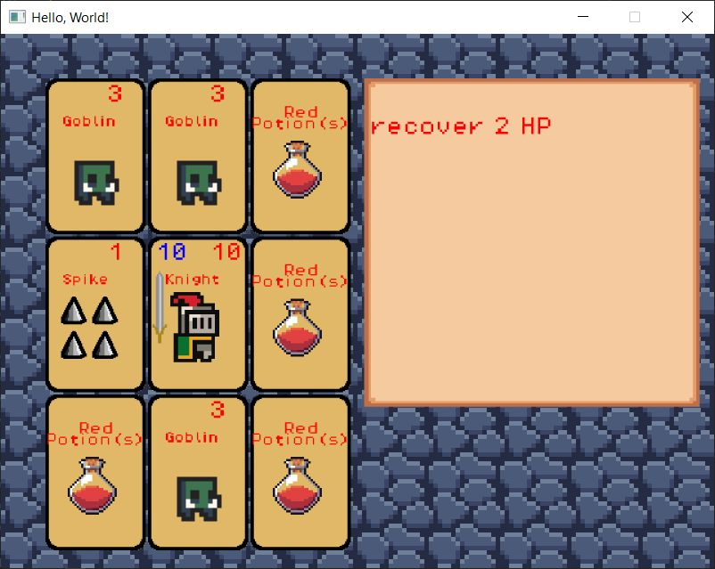

# Rogue Solitaire

[**Play it from Browser**](https://kharism.github.io/roguesolitaire/)

## Intro

It starts as a clone of dungeon cards with some twist I have in mind. At the time of writing this README 
the game should be playable enough without too much content in mind. Just remember there will be quite a bit of bug at the time.

## How to play
You start as knight on the center card. You have HP on top-right of your card and combat on top-left of your card. Your objective is live as long as possible. Click on adjacent (left-right-top-down) card to interact (move, collect item, defeat opp, run through trap). Opponent and trap will have cost to defeat them. Cost is deductible from your combat first then HP unless the damage is direct. If there are trianle on the edge of a card it means the monster can be taken out for free from that direction.

The game still have no clear objective yet

To run the game 

```shell
# download the code
git clone https://github.com/kharism/roguesolitaire.git

# run the game
cd roguesolitaire
go run *.go
```


